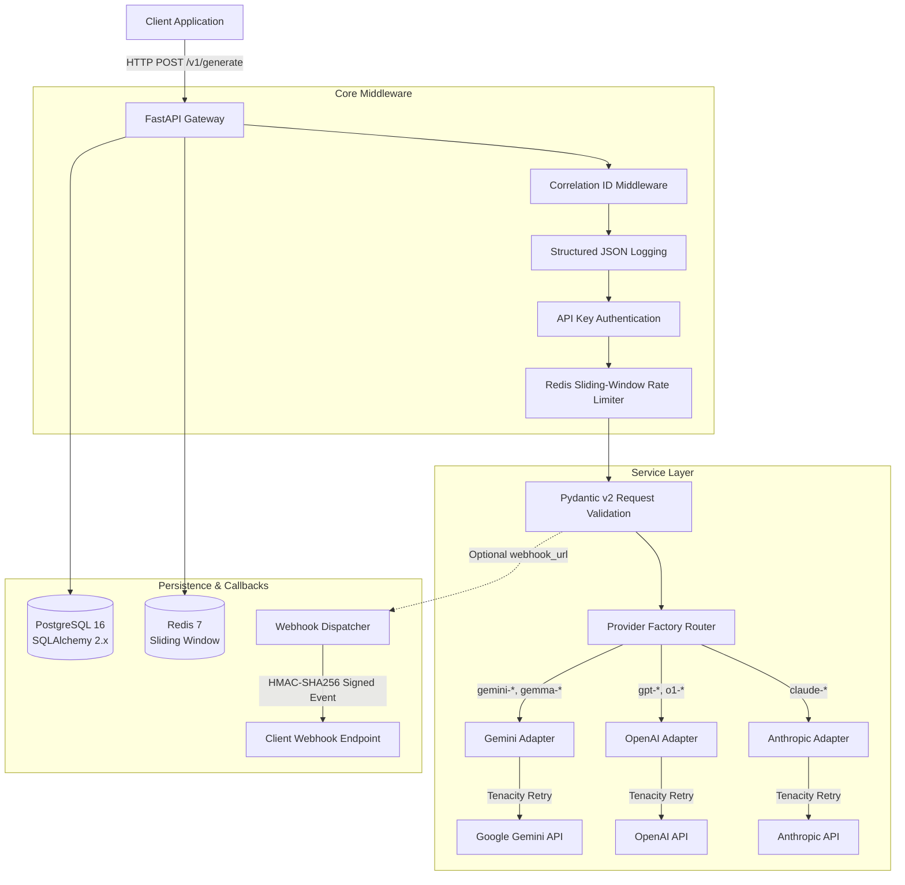

# Production LLM API Gateway

[](https://render.com/deploy?repo=https://github.com/Jemade/API-WRAPPER)

A production-oriented API gateway and reverse proxy built in Python with FastAPI, PostgreSQL, and Redis that controls, observes, and standardizes traffic between client applications and upstream Large Language Model providers (Google Gemini, OpenAI, and Anthropic). It provides API-key authentication with hashed credentials, distributed sliding-window rate limiting, exponential backoff retries for transient upstream failures, normalized response structures, HMAC-SHA256-signed webhook delivery, and structured JSON logging with correlation IDs.

---

## Why I Built This

Connecting client applications directly to third-party LLM providers creates serious production risks: client code becomes tightly coupled to vendor-specific SDK formats, rate limits cannot be enforced across multiple consumers, upstream network hiccups or temporary 5xx errors cause user-facing failures, and auditing token usage across teams requires combing through third-party billing dashboards.

I built this gateway as a centralized control plane to solve these problems:
1. **Vendor Decoupling**: Clients consume a single, normalized API format regardless of whether the underlying model is hosted by Google Gemini, OpenAI, or Anthropic.
2. **Resiliency**: Transient network drops and upstream 5xx outages are automatically absorbed using exponential backoff retries before reaching the user.
3. **Usage Governance & Security**: Distributed sliding-window rate limiting prevents noisy neighbors or runaway loops from blowing through API budgets, and credentials are stored securely as cryptographic hashes.
4. **End-to-End Observability**: Correlation IDs propagate through every HTTP hop, database audit log, and structured JSON log event.

---

## Architecture



---

## Features

- **Provider Abstraction**: Unified adapter interface supporting Google Gemini (`gemini-3.6-flash`, `gemini-flash-latest`, etc.), OpenAI (`gpt-4o`, `o1`, etc.), and Anthropic (`claude-3-5-sonnet`, etc.) with normalized response shapes.
- **API Key Authentication**: Constant-time verification against SHA-256 hashed keys stored in PostgreSQL. Raw keys are never stored.
- **Distributed Rate Limiting**: Atomic Redis sliding-window counter per API key with configurable quotas and documented failure policies (`fail_open` vs `fail_closed`).
- **Resilient Retries**: `tenacity`-powered exponential backoff for transient failures (timeouts, connection resets, 500, 502, 503, 504) while immediately failing on client errors (400, 422).
- **Correlation ID Tracing**: Request IDs generated or accepted from `X-Request-ID` headers, injected into `structlog` contextvars, and traced across DB logs and responses.
- **HMAC-Signed Webhooks**: Background delivery of generation results with HMAC-SHA256 signatures (`X-Webhook-Signature`) and delivery retry tracking in PostgreSQL.
- **Audit Logging**: Full audit trail of every request, token count, latency, and status in PostgreSQL.
- **Production Observability**: Health checks (`/health`, `/ready`) and operational metrics (`/metrics`).
- **OpenAPI 3.1 Documentation**: Clean interactive Swagger docs (`/docs`) and schema (`/openapi.json`).

---

## Tech Stack

| Component | Technology | Rationale |
|---|---|---|
| **Framework** | FastAPI (Python 3.12+) | Async native, high performance, automatic OpenAPI documentation |
| **Validation** | Pydantic v2 | Fast C-level parsing and schema validation |
| **Database** | PostgreSQL 16 + SQLAlchemy 2.x | Relational audit trails and connection pooling with `asyncpg` |
| **Migrations** | Alembic | Version-controlled database migrations |
| **Rate Limiter** | Redis 7 + `redis-py` (async) | In-memory atomic sliding-window operations |
| **HTTP Client** | `httpx` (async) | Native async HTTP/2 client for upstream calls and webhooks |
| **Resilience** | `tenacity` | Declarative, configurable exponential backoff retry policies |
| **Logging** | `structlog` | Contextvar-bound structured JSON logging with automatic secret redaction |
| **Testing** | `pytest`, `pytest-asyncio`, `fakeredis` | High-coverage async test suite running without external dependencies |
| **Containers** | Docker & Docker Compose | Multi-stage, non-root container image and local orchestration |

---

## API Example

### 1. Synchronous Generation Request

```bash
curl -i -X POST http://localhost:8080/v1/generate \
  -H "X-API-Key: gw_live_your_api_key_here" \
  -H "X-Request-ID: req_custom_trace_123" \
  -H "Content-Type: application/json" \
  -d '{
    "model": "gemini-3.6-flash",
    "messages": [
      {"role": "system", "content": "You are a concise engineering tutor."},
      {"role": "user", "content": "What is an idempotency key?"}
    ],
    "temperature": 0.2,
    "max_tokens": 150
  }'
```

---

## Response Example

### Normalized 200 OK Response

```json
{
  "request_id": "req_custom_trace_123",
  "provider": "gemini",
  "model": "gemini-3.6-flash",
  "content": "An idempotency key is a unique token generated by a client to ensure that an API request can be safely retried without performing the same operation multiple times, preventing duplicate transactions.",
  "input_tokens": 28,
  "output_tokens": 36,
  "total_tokens": 64,
  "finish_reason": "stop",
  "latency_ms": 312.43
}
```

### Standard Response Headers
```http
HTTP/1.1 200 OK
content-type: application/json
x-request-id: req_custom_trace_123
x-ratelimit-limit: 60
x-ratelimit-remaining: 59
x-ratelimit-reset: 1789809660
```

---

## Error Handling

All errors return a standardized JSON envelope with a machine-readable `code`, human-readable `message`, and the traceable `request_id`:

```json
{
  "error": {
    "code": "UPSTREAM_TIMEOUT",
    "message": "The upstream provider 'openai' timed out.",
    "request_id": "req_84d12ef901b8"
  }
}
```

### Standard Error Codes
| Code | HTTP Status | Description |
|---|---|---|
| `INVALID_REQUEST` | 422 | Request body failed Pydantic validation |
| `UNAUTHORIZED` | 401 | Missing, malformed, or inactive API key |
| `RATE_LIMITED` | 429 | Exceeded requests/minute limit (includes `Retry-After` header) |
| `UPSTREAM_BAD_REQUEST` | 502 | Upstream model rejected the prompt (e.g. context length exceeded) |
| `UPSTREAM_TIMEOUT` | 504 | Upstream provider timed out after max retries |
| `UPSTREAM_UNAVAILABLE` | 503 | Upstream provider returned 5xx or connection failed |
| `PROVIDER_CONFIGURATION_ERROR`| 500 | Gateway missing required upstream API credentials |
| `WEBHOOK_DELIVERY_FAILED` | 500 | Webhook callback failed after all retries |
| `INTERNAL_ERROR` | 500 | Unhandled internal exception |

---

## Rate Limiting

The rate limiter tracks requests per API key using a Redis sliding-window sorted set:
- **Default**: 60 requests per minute per key (configurable via `RATE_LIMIT_PER_MINUTE`).
- **Custom Per-Key Limits**: Individual API keys can override the default limit via the `rate_limit_per_minute` column in the database.
- **Headers**: Every response contains `X-RateLimit-Limit`, `X-RateLimit-Remaining`, and `X-RateLimit-Reset`.

### Redis Failure Policy (`RATE_LIMIT_REDIS_FAILURE_POLICY`)
If Redis goes down in production, the gateway behaves according to an explicit policy:
- **`fail_open` (Default)**: Logs a warning, sets response header `X-RateLimit-Degraded: true`, and allows the request through. This ensures a Redis failure does not bring down the entire API gateway.
- **`fail_closed`**: Rejects incoming requests with HTTP 429 / `RATE_LIMITED` to prevent uncontrolled upstream spend during infrastructure failures.

---

## Retry Strategy

Transient failures are automatically retried using `tenacity`:
- **Retried**: Connection timeouts (`httpx.TimeoutException`), connection drops (`httpx.NetworkError`), and temporary upstream 5xx errors (500, 502, 503, 504).
- **Never Retried**: Client validation errors (400, 422), authentication failures (401, 403), or invalid model names.
- **Backoff**: Exponential backoff ($\text{min}=0.5\text{s}, \text{max}=10\text{s}$) with a maximum of 3 attempts (`MAX_RETRIES`).
- Every retry attempt is logged with `attempt`, `provider`, `model`, and `request_id`.

---

## Webhooks

For asynchronous or long-running tasks, pass `webhook_url` in the request body:

```json
{
  "model": "gpt-4o",
  "messages": [{"role": "user", "content": "Analyze this dataset..."}],
  "webhook_url": "https://client.example.com/api/webhooks/llm"
}
```

The gateway delivers an HMAC-SHA256-signed POST request upon completion:
```http
POST /api/webhooks/llm HTTP/1.1
Host: client.example.com
Content-Type: application/json
X-Webhook-ID: evt_81e9b2c3...
X-Webhook-Timestamp: 2026-09-19T11:00:00Z
X-Webhook-Signature: v1=3f89a...
X-Request-ID: req_custom_trace_123
```

### Signature Verification (Python Example)
```python
import hmac, hashlib


def verify_signature(payload_bytes: bytes, secret: str, signature_header: str) -> bool:
    raw_sig = signature_header.replace("v1=", "")
    expected = hmac.new(secret.encode(), payload_bytes, hashlib.sha256).hexdigest()
    return hmac.compare_digest(expected, raw_sig)
```

---

## Local Development

### 1. Prerequisites
- Python 3.12+
- PostgreSQL & Redis (or Docker)

### 2. Setup
```bash
git clone https://github.com/Jemade/API-WRAPPER.git
cd API-WRAPPER

python3 -m venv .venv
source .venv/bin/activate
pip install -e ".[dev]"
```

### 3. Environment Setup
```bash
cp .env.example .env
# Edit .env with your OPENAI_API_KEY / ANTHROPIC_API_KEY and database URLs
```

### 4. Run Migrations & Create API Key
```bash
# Run database migrations
alembic upgrade head

# Generate a client API key
python scripts/create_api_key.py --name "Development Key" --rate-limit 60
```

### 5. Start Application
```bash
uvicorn app.main:app --host 0.0.0.0 --port 8080 --reload
```

---

## Environment Variables

| Variable | Default | Description |
|---|---|---|
| `APP_ENV` | `development` | Environment: `development`, `staging`, `production` |
| `DATABASE_URL` | `sqlite+aiosqlite:///...` | SQLAlchemy async connection string (Postgres or SQLite fallback) |
| `REDIS_URL` | `redis://localhost:6379/0` | Redis connection URL |
| `RATE_LIMIT_PER_MINUTE` | `60` | Default requests per minute per key |
| `RATE_LIMIT_REDIS_FAILURE_POLICY` | `fail_open` | `fail_open` (allow traffic) or `fail_closed` (reject with 429) |
| `GEMINI_API_KEY` | None | Google Gemini API secret key |
| `GEMINI_API_BASE` | `https://generativelanguage.googleapis.com/v1beta` | Google Gemini API base endpoint |
| `OPENAI_API_KEY` | None | OpenAI API secret key |
| `OPENAI_API_BASE` | `https://api.openai.com/v1` | OpenAI API base endpoint |
| `ANTHROPIC_API_KEY` | None | Anthropic API secret key |
| `ANTHROPIC_API_BASE` | `https://api.anthropic.com/v1` | Anthropic API base endpoint |
| `WEBHOOK_SECRET` | Required in prod | Secret key for signing HMAC-SHA256 webhook payloads |
| `MAX_RETRIES` | `3` | Maximum retry attempts for transient upstream failures |
| `UPSTREAM_TIMEOUT_SECONDS`| `30.0` | Timeout per upstream provider request |
| `CORS_ORIGINS` | `*` | Allowed CORS origins (comma-separated) |
| `LOG_LEVEL` | `INFO` | Logging level (`DEBUG`, `INFO`, `WARNING`, `ERROR`) |

---

## Running Tests

The test suite runs with 100% test isolation using in-memory SQLite and `fakeredis`, requiring no external daemons:

```bash
# Run all unit and integration tests
pytest -v

# Run with coverage report
pytest --cov=app --cov-report=term-missing

# Run code style and lint checks
ruff check .
ruff format --check .

# Run static type checking
mypy app
```

---

## Docker

### Start Full Stack (API, PostgreSQL, Redis)
```bash
docker compose up -d
```

### Check Logs & Status
```bash
docker compose ps
docker compose logs -f api
```

### Run Migrations inside Docker
```bash
docker compose exec api alembic upgrade head
```

---

## Deployment

[](https://render.com/deploy?repo=https://github.com/Jemade/API-WRAPPER)

The repository includes a ready-to-use Render Blueprint (`render.yaml`) that provisions the API Gateway web service, managed PostgreSQL database, and Redis instance in a single click.

### 1-Click Deployment on Render

1. Click the **Deploy to Render** button above or open:
   `https://render.com/deploy?repo=https://github.com/Jemade/API-WRAPPER`
2. Connect your GitHub account if prompted.
3. In the Blueprint configuration screen:
   - Provide your `GEMINI_API_KEY` (and optionally `OPENAI_API_KEY` / `ANTHROPIC_API_KEY`).
   - The PostgreSQL database (`gateway-postgres`) and Redis service (`gateway-redis`) are provisioned automatically.
   - `WEBHOOK_SECRET` is automatically generated.
4. Click **Apply**. Render builds the Docker container, executes database migrations (`alembic upgrade head`), and starts the gateway service.
5. Once deployed, open the **Shell** tab in the Render dashboard and generate a client API key:
   ```bash
   python scripts/create_api_key.py --name "Production Client" --rate-limit 60
   ```

### Other Platforms
The service is packaged as a standard container ready for deployment on any container platform (Fly.io, Railway, AWS ECS, GCP Cloud Run).

#### Deployment Guidelines:
1. **Database & Cache**: Provision managed PostgreSQL and Redis instances.
2. **Environment Variables**: Set `DATABASE_URL`, `REDIS_URL`, `WEBHOOK_SECRET`, and provider API keys in your platform dashboard.
3. **Migration on Release**: Run `alembic upgrade head` as a release phase command or startup step.
4. **Health Check Probes**:
   - Liveness Probe: `GET /health` (expects 200)
   - Readiness Probe: `GET /ready` (expects 200; pings PostgreSQL and Redis)

---

## API Documentation

- **Interactive Swagger UI**: [http://localhost:8080/docs](http://localhost:8080/docs)
- **ReDoc UI**: [http://localhost:8080/redoc](http://localhost:8080/redoc)
- **Raw OpenAPI Schema**: [http://localhost:8080/openapi.json](http://localhost:8080/openapi.json)

---

## Security Considerations

1. **API Key Storage**: Keys are hashed using SHA-256 before insertion. Even with full database access, attackers cannot reverse raw client keys.
2. **Constant-Time Verification**: All key comparisons and HMAC webhook verifications use `secrets.compare_digest` to prevent timing attacks.
3. **Secret Redaction**: Structured logging filters out headers and keys matching `api_key`, `authorization`, `secret`, and `token`.
4. **Payload Limiting**: Max body size is capped at 2MB (`MAX_REQUEST_SIZE_BYTES`) to prevent denial-of-service memory exhaustion.
5. **Least Privilege Container**: The Docker image executes as an unprivileged user (`gateway`, UID 1001).

---

## Limitations

- **Streaming (SSE)**: Currently optimized for atomic request/response completions. Streaming SSE token responses are planned for a future release.
- **Provider Count**: Currently includes OpenAI and Anthropic adapters. Additional providers (Google Gemini, Mistral, Ollama) can be added by implementing the `LLMProvider` interface.
- **Background Worker**: Webhook deliveries are currently executed via background async tasks. For high-volume enterprise deployments, offloading deliveries to Celery, ARQ, or BullMQ is recommended.

---

## Design Decisions

1. **Why not expose provider SDKs directly?**
   Exposing raw provider response formats leaks upstream vendor details to clients. When OpenAI changes a parameter name or Anthropic structures tool calls differently, every downstream application breaks. Normalizing requests and responses shields client applications completely.
2. **Why SHA-256 for API keys instead of bcrypt?**
   API gateways must authenticate every single incoming HTTP request with sub-millisecond latency. High-cost password hashing algorithms like bcrypt (cost factor $\ge 12$) take 100-300ms per check, making them unsuitable for high-throughput API gateways. High-entropy random keys (e.g. 256 bits of CSPRNG randomness) have no risk of dictionary attacks, making SHA-256 both mathematically secure and fast.
3. **Why Sliding Window over Fixed Window Rate Limiting?**
   Fixed window counters suffer from the "boundary burst" problem (clients can send 2x their quota at the boundary of two windows). A sliding window via Redis sorted sets guarantees strict rate enforcement across any 60-second slice of time.

---

## Future Improvements

- [ ] Server-Sent Events (SSE) streaming response support
- [ ] Fallback routing (automatically try Anthropic if OpenAI is down)
- [ ] Semantic caching of completions using Redis vector embeddings
- [ ] Token usage budgeting / monthly quotas per client key
- [ ] Prometheus metrics exporter (`/metrics` in OpenMetrics format)

---

## License

MIT License - see [LICENSE](LICENSE) for details.
