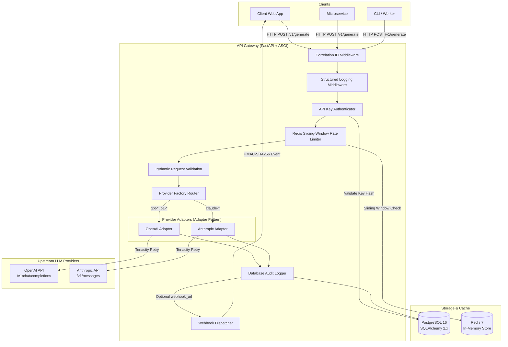
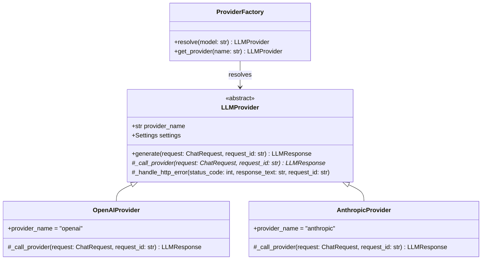
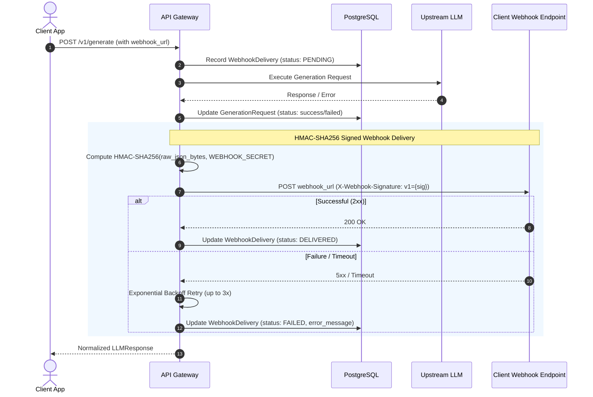

# Production LLM API Gateway Architecture

## 1. System Overview

The **Production LLM API Gateway** acts as a secure, observable reverse proxy and control plane between client applications and third-party Large Language Model (LLM) providers (such as OpenAI and Anthropic).

It decouples client consumers from provider-specific SDKs, enforces uniform authentication, applies distributed token/sliding-window rate limits, automatically retries transient network or 5xx provider outages with exponential backoff, records structured audit logs in PostgreSQL, and dispatches HMAC-SHA256-signed webhooks for async operations.



---

## 2. Request Lifecycle

1. **Ingress & Correlation**:
   - The request hits the `CorrelationIdMiddleware`.
   - The client may supply an `X-Request-ID` header. If valid (alphanumeric/dashes/underscores, $\le 64$ chars), it is preserved; otherwise, a fresh `req_<uuid4_hex>` identifier is generated.
   - The ID is stored in Python's `contextvars`, making it automatically available to every structured log statement, database record, and downstream error response.

2. **Authentication**:
   - `get_current_client` extracts the raw API key from either `X-API-Key` or `Authorization: Bearer <key>`.
   - The key is hashed using deterministic SHA-256 (`hashlib.sha256(raw_key.encode()).hexdigest()`).
   - The hash is queried against the indexed `key_hash` column in PostgreSQL.
   - If missing, invalid, or inactive, a `401 Unauthorized` is returned immediately with error code `UNAUTHORIZED`.

3. **Rate Limiting**:
   - The client's unique `key_hash` is passed to the `RateLimiter` service.
   - An atomic Redis pipeline evaluates a sliding-window sorted set over the last 60 seconds.
   - If the request count exceeds the client's allocated quota, an HTTP `429 Too Many Requests` is returned along with `Retry-After`, `X-RateLimit-Limit`, `X-RateLimit-Remaining`, and `X-RateLimit-Reset` headers.
   - If Redis is unreachable, the system executes a deliberate failure policy (`fail_open` or `fail_closed`).

4. **Validation & Routing**:
   - Pydantic v2 validates message structure, roles (`system`, `user`, `assistant`), non-empty content, temperature limits ($0.0 \le T \le 2.0$), and maximum token boundaries ($1 \le N \le 32000$).
   - `ProviderFactory` inspects the model name prefix:
     - `gpt-*`, `o1-*`, `o3-*` $\to$ `OpenAIProvider`
     - `claude-*` $\to$ `AnthropicProvider`

5. **Upstream Execution & Resiliency**:
   - The provider adapter transforms normalized messages into provider-specific JSON schemas (e.g. Anthropic requires extracting top-level system prompts separately from the message array).
   - The call is executed using `httpx.AsyncClient` wrapped with `tenacity.AsyncRetrying`.
   - If transient failures occur (timeouts, connection resets, 500, 502, 503, 504), tenacity retries with exponential backoff.
   - Permanent failures (400 Bad Request, 401 Unauthorized) fail immediately without wasteful retries.

6. **Normalization & Auditing**:
   - Provider responses are parsed and mapped into a uniform `LLMResponse` schema.
   - An audit record is written to `generation_requests` with token usage (`input_tokens`, `output_tokens`, `total_tokens`), status (`success` or `failed`), and latency in milliseconds.

7. **Webhook Dispatch (Optional)**:
   - If `webhook_url` was provided, the `WebhookService` prepares an envelope (`event_id`, `timestamp`, `request_id`, `event_type`, `payload`), signs the raw JSON bytes with HMAC-SHA256, and posts to the callback URL with delivery retries.

---

## 3. Provider Abstraction

The gateway follows the **Adapter Pattern** to prevent vendor lock-in.



### Normalized Schema: `LLMResponse`
| Field | Type | Description |
|---|---|---|
| `request_id` | `str` | Correlation ID for end-to-end tracing |
| `provider` | `str` | Provider that fulfilled the request (`openai`, `anthropic`) |
| `model` | `str` | Model identifier used |
| `content` | `str` | Generated completion text |
| `input_tokens` | `int` | Prompt tokens |
| `output_tokens` | `int` | Generated completion tokens |
| `total_tokens` | `int` | Total tokens consumed |
| `finish_reason` | `str` | Standardized finish reason (`stop`, `length`, `end_turn`) |
| `latency_ms` | `float` | Upstream response latency in milliseconds |

---

## 4. Rate Limiting Architecture

The rate limiter employs a Redis sorted-set sliding window:
- **Redis Key**: `ratelimit:{api_key_hash}`
- **Window**: 60 seconds (rolling)
- **Atomicity**: Executed inside an atomic Redis pipeline (`MULTI` / `EXEC`):
  1. `ZREMRANGEBYSCORE key -inf (now - window)`: Evict events older than 60s.
  2. `ZCARD key`: Count active events within the window.
  3. `ZRANGE key 0 0 WITHSCORES`: Fetch the oldest event to compute accurate reset timestamps.
  4. If `count < limit`: `ZADD key now (now:salt)` and `EXPIRE key window + 1`.

### Redis Failure Policy (`RATE_LIMIT_REDIS_FAILURE_POLICY`)
In production, Redis outages can happen. The gateway implements an explicit, configurable policy:
- **`fail_open` (Default)**: If Redis is unreachable, the gateway logs a high-priority warning, sets header `X-RateLimit-Degraded: true`, and allows traffic through. This prevents a cache outage from causing a total API gateway failure.
- **`fail_closed`**: If Redis is unreachable, the gateway rejects requests with `429 Too Many Requests` (or 503) to strictly enforce billing quotas and protect downstream capacity.

---

## 5. Resilient Retry Strategy

The gateway uses `tenacity` for asynchronous retry management.

### Retry Eligibility Matrix
| Failure Condition | HTTP Code / Exception | Retryable? | Rationale |
|---|---|---|---|
| Connection Timeout | `httpx.TimeoutException` | **Yes** | Upstream model inference occasionally spikes in latency |
| Connection Dropped | `httpx.NetworkError` | **Yes** | Ephemeral TCP disconnects or DNS hiccups |
| Provider 5xx | 500, 502, 503, 504 | **Yes** | Upstream server errors or overload |
| Provider 429 | 429 Too Many Requests | **Yes** | Upstream provider rate limits (transient) |
| Invalid Prompt / Schema | 400, 422 | **No** | Deterministic user errors; retrying will never succeed |
| Invalid Credentials | 401, 403 | **No** | Configuration error; retrying wastes compute |

**Backoff Formula**:
$$\text{delay} = \min(\text{max\_delay}, \text{backoff\_factor} \times 2^{\text{attempt}})$$
Default configuration: 3 attempts, exponential backoff starting at 0.5s up to 10s.

---

## 6. Webhook Delivery System

When `webhook_url` is provided in a generation request, the gateway delivers an HMAC-signed event upon completion:



### Signature Verification
The gateway signs the exact JSON bytes with HMAC-SHA256 using `WEBHOOK_SECRET`:
```
X-Webhook-Signature: v1=3b7d19c0...
X-Webhook-Timestamp: 2026-09-19T11:00:00Z
X-Webhook-ID: evt_8e71...
```
The client independently verifies:
$$\text{HMAC-SHA256}(\text{raw\_body}, \text{WEBHOOK\_SECRET}) \stackrel{?}{=} \text{X-Webhook-Signature}$$

---

## 7. Database Responsibilities

PostgreSQL stores relational audit trails with Alembic migrations:
- `api_keys`: Hashed client keys (`key_hash`), safe prefix (`key_prefix`), client names, active status, and custom rate limits. Raw keys are never stored.
- `generation_requests`: Request audit records (`id`, `client_id`, `provider`, `model`, `status`, `input_tokens`, `output_tokens`, `total_tokens`, `latency_ms`, `error_code`, `created_at`).
- `webhook_deliveries`: Delivery audit records (`id`, `request_id`, `webhook_url`, `event_type`, `status`, `attempts`, `last_attempt_at`, `error_message`).

---

## 8. Security Boundaries

1. **Authentication**: Secure constant-time comparison prevents timing attacks on key lookup.
2. **Secret Separation**: Provider API keys (`OPENAI_API_KEY`, `ANTHROPIC_API_KEY`) and webhook secrets are injected via environment variables and never logged or serialized to clients.
3. **Log Sanitization**: Structured logging automatically redacts headers and fields containing `api_key`, `authorization`, `secret`, and `token`. Prompt body logging is explicitly disabled by default.
4. **Input Sanitization**: Request bodies are capped at 2MB (`MAX_REQUEST_SIZE_BYTES`) and validated with strict Pydantic constraints.
